# Codex Pet Collection

**16 个自定义动画宠物 · 龙族、上古之神、元素领主与宇宙核心**

一组用 Codex 与 Hatch Pet 制作的个人宠物作品。小小的屏幕伙伴，保留各自鲜明的性格与轮廓。

<table>
<tr>
<td align="center" width="50%"><h3>C’Thun · 克苏恩</h3><a href="pets/cthun-pixel/">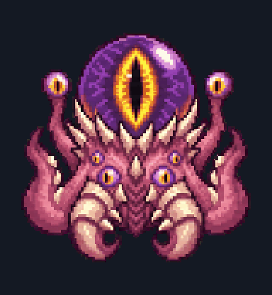</a><br>黄金巨眼 · 远古凝视<br><a href="pets/cthun-pixel/">查看宠物与工作动画</a></td>
<td align="center" width="50%"><h3>Atlas · 阿特拉斯</h3><a href="pets/atlas-pixel/">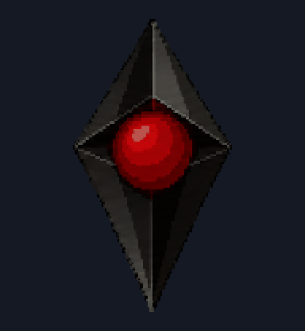</a><br>黑色菱形 · 红色现实核心<br><a href="pets/atlas-pixel/">查看宠物与工作动画</a></td>
</tr>
</table>

[完整图鉴](#完整图鉴) · [安装](#安装) · [动画说明](#动画说明) · [下载合集](https://github.com/maxsssssssssss/codex-pet-collection/archive/refs/heads/main.zip)

## 完整图鉴

<table>
<tr>
<td align="center" width="25%"><a href="pets/cthun-pixel/">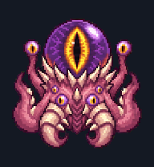<br><b>克苏恩</b></a></td>
<td align="center" width="25%"><a href="pets/atlas-pixel/">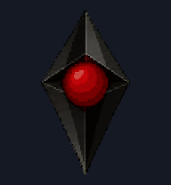<br><b>Atlas · 阿特拉斯</b></a></td>
<td align="center" width="25%"><a href="pets/noxcrown-pixel/">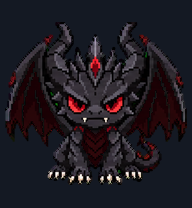<br><b>Noxcrown · 黑龙王</b></a></td>
<td align="center" width="25%"><a href="pets/deathwing-pixel/">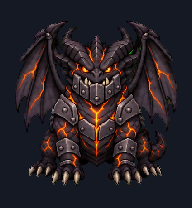<br><b>死亡之翼</b></a></td>
</tr>
<tr>
<td align="center" width="25%"><a href="pets/alexstrasza-pixel/">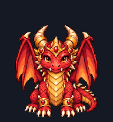<br><b>阿莱克丝塔萨</b></a></td>
<td align="center" width="25%"><a href="pets/ysera-pixel/">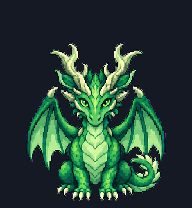<br><b>伊瑟拉</b></a></td>
<td align="center" width="25%"><a href="pets/malygos-pixel/">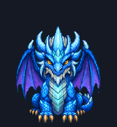<br><b>玛里苟斯</b></a></td>
<td align="center" width="25%"><a href="pets/nozdormu-pixel/">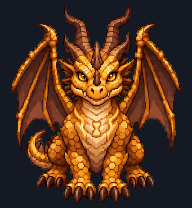<br><b>诺兹多姆</b></a></td>
</tr>
<tr>
<td align="center" width="25%"><a href="pets/galakrond-pixel/">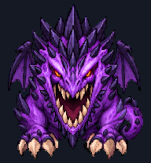<br><b>迦拉克隆</b></a></td>
<td align="center" width="25%"><a href="pets/yogg-saron-pixel/">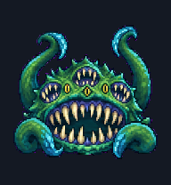<br><b>尤格萨隆</b></a></td>
<td align="center" width="25%"><a href="pets/yshaarj-pixel/">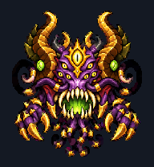<br><b>亚煞极</b></a></td>
<td align="center" width="25%"><a href="pets/nzoth-pixel/">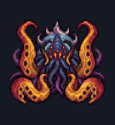<br><b>恩佐斯</b></a></td>
</tr>
<tr>
<td align="center" width="25%"><a href="pets/nzoth-warlock-pixel/">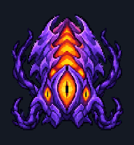<br><b>恩佐斯 · 深渊术士</b></a></td>
<td align="center" width="25%"><a href="pets/ragnaros-pixel/">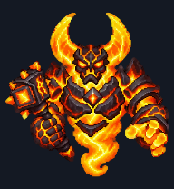<br><b>拉格纳罗斯</b></a></td>
<td align="center" width="25%"><a href="pets/axiom-order-core/">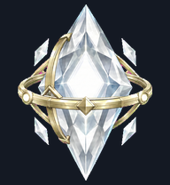<br><b>Axiom · 秩序晶核</b></a></td>
<td align="center" width="25%"><a href="pets/axiom-pixel-core/">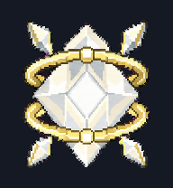<br><b>Axiom Pixel · 像素晶核</b></a></td>
</tr>
</table>

点击宠物可查看待机和工作动画。合集包括 7 条龙、5 个上古之神形态、拉格纳罗斯、2 个晶核和 Atlas；秩序晶核保留其非像素风格，其余以像素风为主。

## 安装

1. 点击 **Code → Download ZIP**，解压合集；也可以使用 `git clone`。
2. 在本机的 Codex 数据目录下找到或创建 `pets` 文件夹。默认位置见下表；如果设置了 `CODEX_HOME`，则使用 `$CODEX_HOME/pets`。
3. 将所选宠物文件夹（例如 `pets/cthun-pixel`）复制进去，保留文件夹内的 `pet.json` 与 `spritesheet.webp`。如果已有同名宠物，先备份旧版本。
4. 在桌面应用的 **Settings → Pets** 中点击 **Refresh**，选择宠物。界面名称可能随应用版本变化，参见 [OpenAI 官方 Pets 说明](https://learn.chatgpt.com/docs/pets)。

| 系统 | 默认安装位置 |
| --- | --- |
| Windows | `%USERPROFILE%\.codex\pets\<pet-id>\` |
| macOS / Linux 本地宠物目录 | `~/.codex/pets/<pet-id>/` |

以克苏恩为例，安装后应为：

```text
.codex/pets/cthun-pixel/
├── pet.json
└── spritesheet.webp
```

## 动画说明

每个宠物使用 v2 图集：**1536 × 2288，8 × 11 格，每格 192 × 208**。包含 9 组标准动画、1 个中立帧与 16 个方向帧。

| 图集行 | 资源状态 |
| --- | --- |
| 0 | idle · 待机，并在第 7 格保存中立帧 |
| 1–2 | running-right / running-left · 向右 / 向左移动 |
| 3–4 | waving / jumping · 致意 / 跃起 |
| 5–6 | failed / waiting · 失败 / 等待 |
| 7–8 | running / review · 工作 / 待查看 |
| 9–10 | 16 个方向响应帧 |

下载后用浏览器打开根目录的 **preview.html**，可切换全部宠物、状态与方向。GitHub 文件页只展示 HTML 源码；本地打开即可，无需安装依赖。

GIF 与网页用于循环展示动画素材，不模拟桌面应用的触发时机。Atlas 的无脸几何设计使方向变化较含蓄。实际播放由应用版本、任务状态和动态效果设置决定。

## 文件与校验

`pets/` 保存安装文件，`previews/` 保存展示图；`catalog.json` 记录清单和安装文件 SHA-256。安装素材与本地最终版本逐字节一致。使用 Python 3 可运行：

```sh
python scripts/verify.py
```

该命令核对文件哈希、清单与 v2 参数，不代表已在所有系统版本上完成播放测试。

## 关于作品

本合集由 AI 辅助生成并经人工选择、调整与检查。Noxcrown 与 Axiom 为原创角色；Warcraft / Hearthstone 同人角色的原始设定属于 Blizzard Entertainment，Atlas 的原始设定来自 Hello Games 的 No Man’s Sky。本项目为个人同人作品，与 OpenAI、Blizzard Entertainment 或 Hello Games 无隶属关系。
