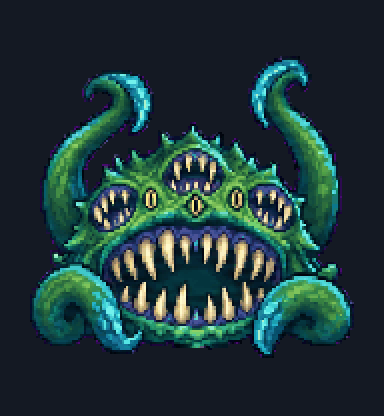
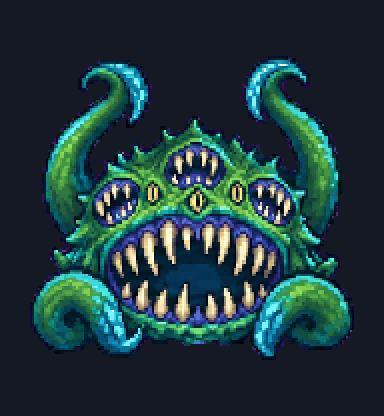

# 尤格萨隆

Hearthstone Yogg-Saron, Hope's End as a chibi front-facing pixel pet: enormous toothed maw, many watching eyes and four teal tentacles.

| 待机 · Idle | 工作 · Working |
| :---: | :---: |
|  |  |

将本文件夹中的 `pet.json` 和 `spritesheet.webp` 一起安装。详见[安装说明](../../README.md#安装)。

格式：Codex v2，1536 × 2288，8 × 11 格；每格 192 × 208。包含 9 组标准动画、1 个中立帧与 16 个方向帧。

[返回图鉴](../../README.md) · [打开全部动画预览](../../preview.html)
